# Първи стъпки в програмирането

Задачи за упражнение в клас и за домашно към курса ["Основи на програмирането" @ СофтУни](https://softuni.bg/courses/programming-basics).

Тествайте решенията си в **judge системата**: [https://judge.softuni.org/Contests/2339/First-Steps-In-Coding-Lab](https://judge.softuni.org/Contests/2339/First-Steps-In-Coding-Lab)

## 01\. Конзолна програма "Hello SoftUni"

Напишете **конзолна C# програма**, която отпечатва текста "**Hello
SoftUni**".

### Насоки

1.  Стартирайте **Visual Studio**

2.  Създайте нов проект: **Create a new project**

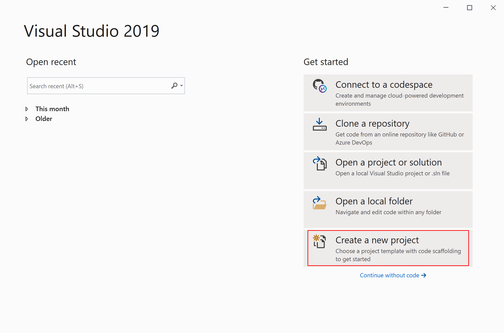

3.  Изберете: **Console App (.NET Core)**

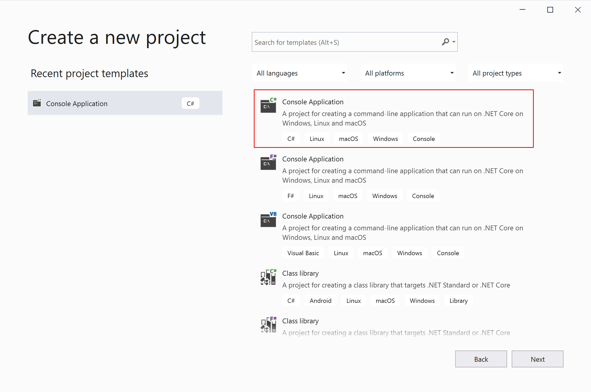

4.  Въведете **подходящо име** на проекта и **директория**, в която да
    се създаде.

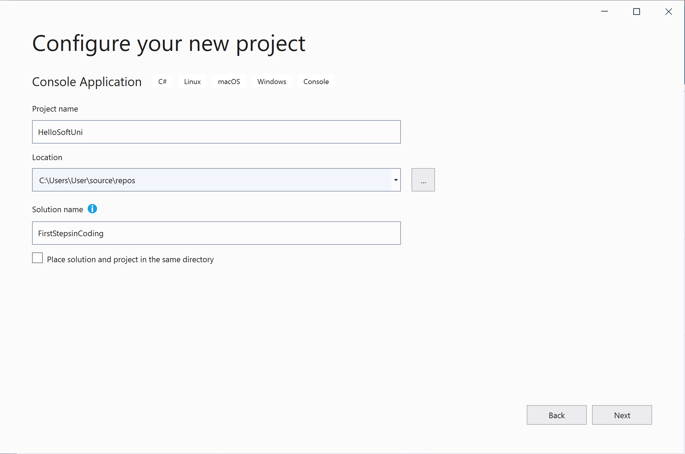

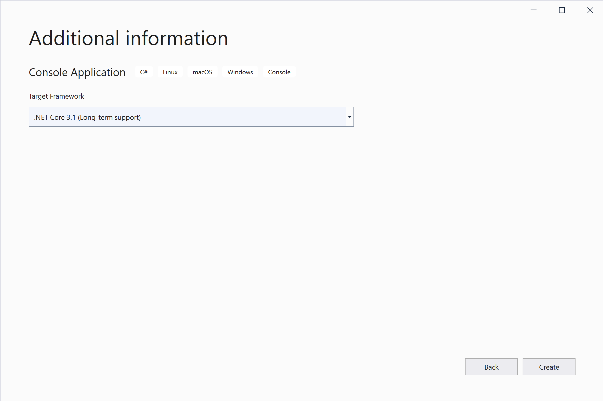

5.  Намерете секцията **Main(string\[\] args)**. В нея се пише програмен
    код (команди) на езика C#.

6.  Придвижете курсора между отварящата и затварящата скоба **{ }**.

7.  Натиснете **Enter** след отварящата скоба **{**.

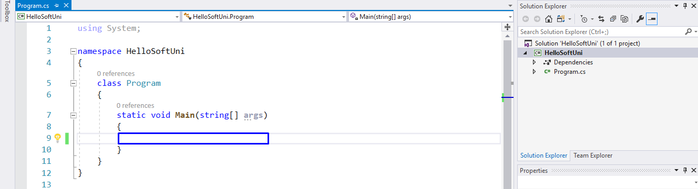

8.  Напишете следния програмен код (команда за печатане на текста
    **"Hello SoftUni"**):

| Console.WriteLine("Hello SoftUni"); |
| ----------------------------------- |

Кодът на програмата се пише отместен навътре с една табулация спрямо
отварящата скоба **{**.

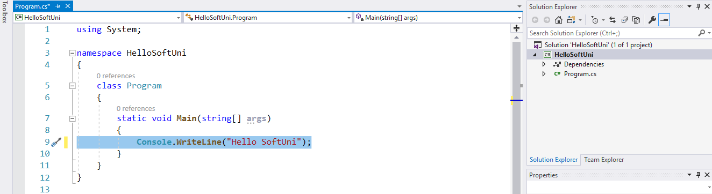

9.  **Стартирайте** програмата с натискане на **Ctrl+F5**. Трябва да
    получите следния резултат:

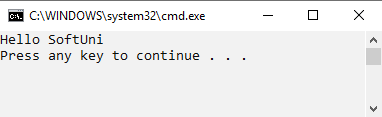

10. **Тествайте** решението на тази задача в онлайн judge системата на
    СофтУни. За целта първо отворете
    <https://judge.softuni.org/Contests/Compete/Index/2339#0>. Влезте с
    вашето потребителско име в СофтУни. Ще се появи прозорец за
    изпращане на решения за задача "**Hello SoftUni**". Копирайте сорс
    кода от Visual Studio и го поставете в полето за изпращане на
    решения:

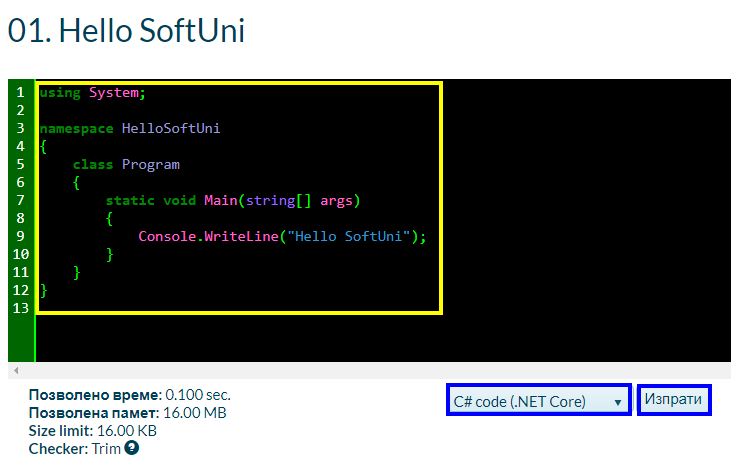

11. **Изпратете решението** за оценяване с бутона **Submit**. Ще
    получите резултата след няколко секунди в таблицата с изпратени
    решения в judge системата:

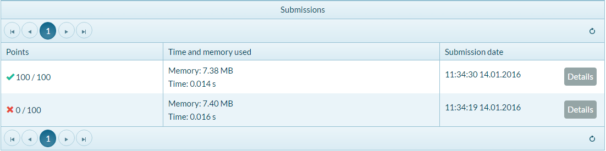

## 02\. Числата от 1 до 10

Напишете C# конзолна програма, която **отпечатва числата от 1 до 10** на
отделни редове на конзолата.

### Насоки

1.  Създайте конзолно C# приложение с име "**Nums1To10**".

2.  Напишете 10 команди **Console.WriteLine()**, една след друга, за да
    отпечатате числата от 1 до 10.

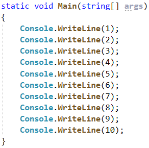

3.  **Тествайте** вашето решение на задачата в [Judge](https://judge.softuni.org/Contests/Compete/Index/2339#1)
    системата.

## 03\. Пресмятане на лице на правоъгълник

Да се напише **конзолна програма**, която **въвежда две цели числа (страните на правоъгълника a и b)** и **пресмята лицето на правоъгълник
с тези страни.**

### Примерен вход и изход

<table>
<colgroup>
<col style="width: 50%" />
<col style="width: 49%" />
</colgroup>
<thead>
<tr class="header">
<th><strong>вход</strong></th>
<th><strong>изход</strong></th>
</tr>
</thead>
<tbody>
<tr class="odd">
<td>
5

7
</td>
<td>35</td>
</tr>
</tbody>
</table>

<table>
<colgroup>
<col style="width: 50%" />
<col style="width: 49%" />
</colgroup>
<thead>
<tr class="header">
<th><strong>вход</strong></th>
<th><strong>изход</strong></th>
</tr>
</thead>
<tbody>
<tr class="odd">
<td>
6

8
</td>
<td>48</td>
</tr>
</tbody>
</table>

### Насоки

1.  **Инициализирайте** две променливи (a и b) и в тях запишете
    стойностите въведени от конзолата:

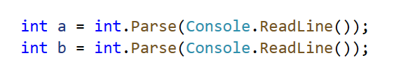

2.  **Инициализирайте втора променлива area**, в която да запишете
    стойността за лицето на правоъгълника, получена по формулата **a \*
    b**. Принтирайте получения резултат:

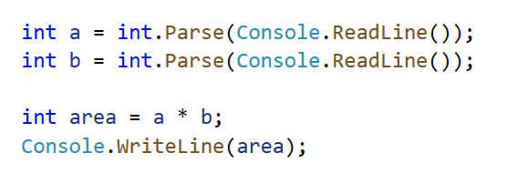

## 04\. Конвертор: инчове към сантиметри

Да се напише програма, която **чете от конзолата реално число** и го
преобразува **от инчове в сантиметри**. За целта **умножете инчовете по
2.54** (1 инч = 2.54 сантиметра).

### Примерен вход и изход

| **вход** | **изход** |
| -------- | --------- |
| 5        | 12.7      |

| **вход** | **изход** |
| -------- | --------- |
| 7        | 17.78     |

**Внимание:** в зависимост от регионалните настройки на операционната
система, е възможно вместо **десетична точка** (US настройки) да се
използва **десетична запетая** (BG настройки). Ако програмата очаква
десетична точка и бъде въведено число с десетична запетая или на обратно
(бъде въведена десетична точка, когато се очаква десетична запетая), ще
се получи следната грешка:

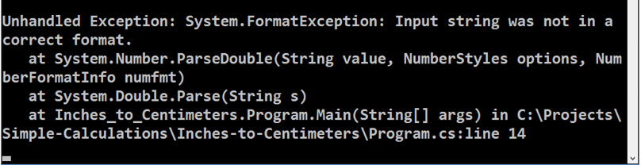

Препоръчително е **да промените настройките на компютъра си**, така че
да се използва **десетична точка**:

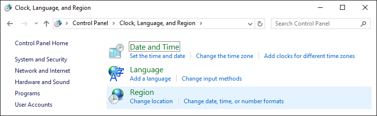

## 05\. Поздрав по име

Да се напише програма, която **чете от конзолата текст (име на човек)**
и отпечатва "**Hello,** **\<name\>!**", където **\<name\>** е въведеното
име от конзолата.

### Насоки

1.  Създайте променливата **name** от тип **string** и запазете в нея
    името, което получавате от конзолата.

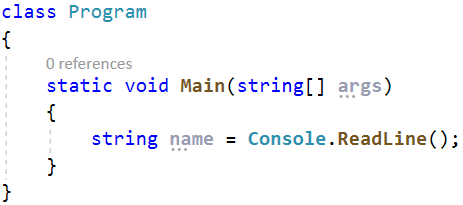

2.  Изведете изхода на конзолата като използвате конкатенация (долепяне
    на текстове):

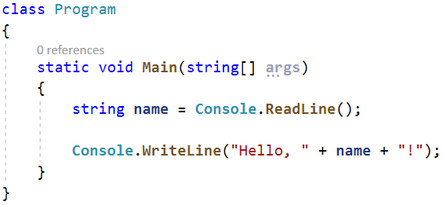

3.  Стартирайте програмата с **Ctrl + F5** и тествайте с различни входни
    примери.

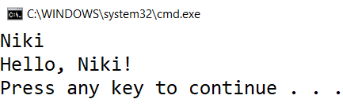

## 06\. Съединяване на текст и числа

Напишете програма, която прочита от конзолата **име**, **фамилия**,
**възраст** и **град** и печата следното съобщение: "**You are\<firstName\> \<lastName\>, a \<age\>-years old person from \<town\>.**"

### Насоки

1.  Добавете към текущото Visual Studio решение още един **конзолен
    проект**, като изберем с десен бутон върху проекта **Add -\> New
    Project...**

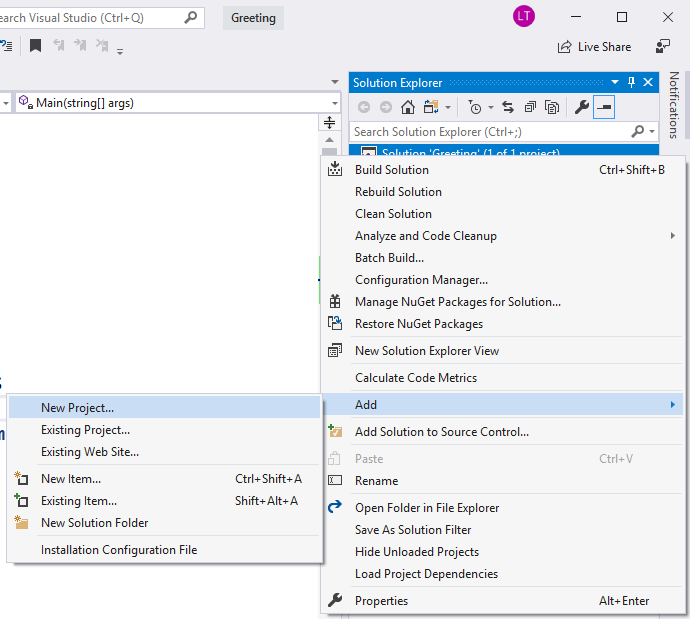

2.  Въведете входните данни и ги запишете в променливи с подходящ тип
    данни:  

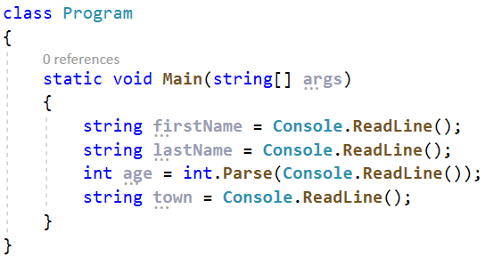

3.  Изведете на конзолата форматирания изход:  

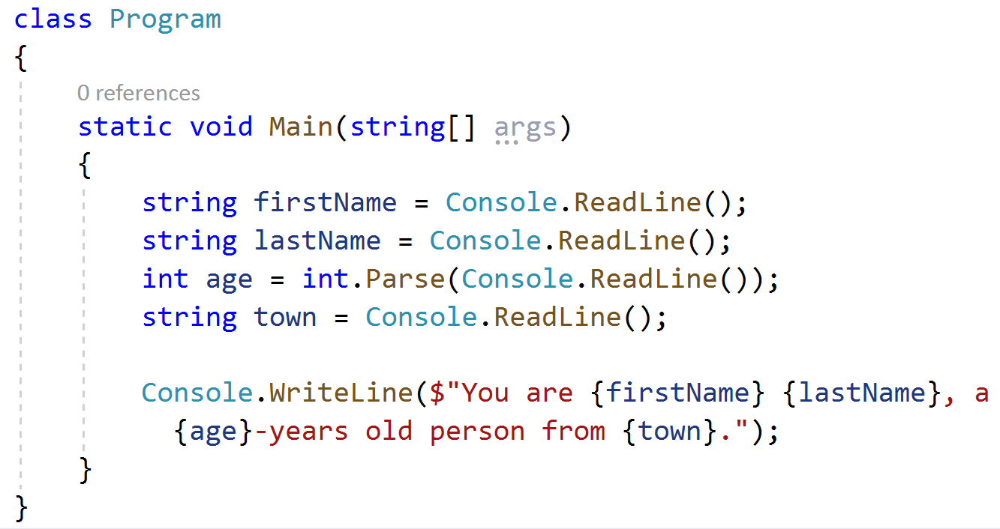

4.  Стартирайте програмата с **Ctrl + F5** и тествайте с различни входни
    примери.

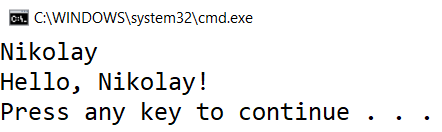

**Ако все още получавате резултата от миналата задача, това се получава, защото не сте сменили стартовия проект. Как да се справите с проблема?**

**Както виждате Greeting проекта е с удебелени черни букви – това означава, че това е вашият стартов проект. За да смените стартовия проект, изберете с десен бутон върху желания проект Set as StartUp Project.**

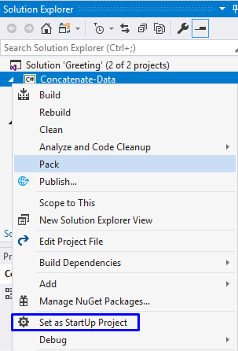

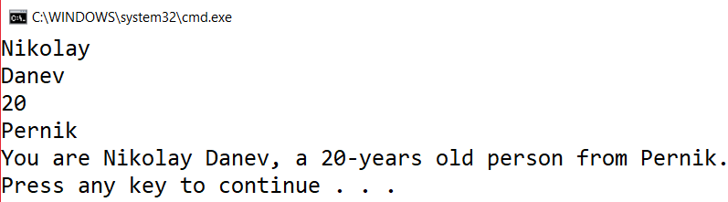

## 07\. Изготвяне на проекти

Напишете програма, която **изчислява** **колко часа** ще са необходими
на един архитект, за да **изготви проектите** на няколко строителни
обекта. Изготвянето на един проект отнема **три часа**.

**Вход**

От конзолата се четат **2 реда**:

1.  **Името на архитекта - текст**

2.  **Брой на проектите, които трябва да изготви - цяло число в
    интервала \[0 … 100\]**

**Изход**

На конзолата се отпечатва:

- **"The architect {името на архитекта} will need {необходими часове} hours to complete {брой на проектите} project/s."**

**Примерен вход и изход**

<table>
<colgroup>
<col style="width: 11%" />
<col style="width: 32%" />
<col style="width: 2%" />
<col style="width: 11%" />
<col style="width: 41%" />
</colgroup>
<thead>
<tr class="header">
<th><strong>вход</strong></th>
<th><strong>изход</strong></th>
<th rowspan="2"></th>
<th><strong>вход</strong></th>
<th><strong>изход</strong></th>
</tr>
<tr class="odd">
<th>
George

4
</th>
<th>The architect George will need 12 hours to complete 4
project/s.</th>
<th>
Sanya

9
</th>
<th>The architect Sanya will need 27 hours to complete 9 project/s.</th>
</tr>
</thead>
<tbody>
</tbody>
</table>

## 08\. Зоомагазин

Напишете програма, която **пресмята нужните разходи** за закупуването на храна за кучета и котки. Храната се пазарува от зоомагазин, като една опаковка храна за **кучета е на цена 2.50 лв**, а опаковка храна за **котки струва 4 лв.**

**Вход**

От конзолата се четат **2 реда**:

1.  **Броят на опаковките храна за кучета – цяло число в интервала \[0…100\]**

2.  **Броят на опаковките храна за котки – цяло число в интервала \[0…100\]**

**Изход**

На конзолата се отпечатва:

**"{крайната сума} lv."**

**Примерен вход и изход**

<table style="width:100%;">
<colgroup>
<col style="width: 14%" />
<col style="width: 22%" />
<col style="width: 27%" />
<col style="width: 14%" />
<col style="width: 22%" />
</colgroup>
<thead>
<tr class="header">
<th><strong>вход</strong></th>
<th><strong>изход</strong></th>
<th rowspan="2"></th>
<th><strong>вход</strong></th>
<th><strong>изход</strong></th>
</tr>
<tr class="odd">
<th>
5

4
</th>
<th>28.5 lv.</th>
<th>
13

9
</th>
<th>68.5 lv.</th>
</tr>
</thead>
<tbody>
</tbody>
</table>

## 09\. Озеленяване на дворове

Божидара разполага с **няколко къщи** на Черноморието и **желае да
озелени дворовете на някои от тях,** като по този начин създаде **уютна
обстановка** **и комфорт на гостите си**. За целта е наела фирма.

Напишете програма, която **изчислява необходимате сума**, които Божидара
ще трябва да заплати на фирмата изпълнител на проекта. Цената на **един
кв. м. е 7.61 лв със ДДС**. Понеже нейният двор е **доста голям**,
фирмата изпълнител предлага **18% отстъпка от крайната цена**.

**Вход**

От конзолата се прочита само **един ред**:

1.  **Кв. метри, които ще бъдат озеленени – реално число в интервала \[0.00 … 10000.00\]**

**Изход**

На конзолата се отпечатват **два реда**:

- **"The final price is: {крайна цена на услугата} lv."**

- **"The discount is: {отстъпка} lv."**

**Примерен вход и изход**

<table>
<colgroup>
<col style="width: 10%" />
<col style="width: 37%" />
<col style="width: 51%" />
</colgroup>
<thead>
<tr class="header">
<th><strong>Вход</strong></th>
<th><strong>Изход</strong></th>
<th><strong>Обяснения</strong></th>
</tr>
</thead>
<tbody>
<tr class="odd">
<td><strong>550</strong></td>
<td>
The final price is: 3432.11 lv.

The discount is: 753.39 lv.
</td>
<td>
Пресмятаме цената за озеленяване на целия двор:

<strong>550</strong> * <strong>7.61</strong> =
<strong>4185.50</strong> лв.

Приспадаме отстъпката (18% = 0.18) от общата сума:

<strong>0.18</strong> * <strong>4185.5</strong> =
<strong>753.39</strong> лв.

Калкулираме крайната цена на услугата:

<strong>4185.50</strong> – <strong>753.39</strong> 3432.11
лв.
</td>
</tr>
<tr class="even">
<td><strong>Вход</strong></td>
<td><strong>Изход</strong></td>
<td></td>
</tr>
<tr class="odd">
<td>150</td>
<td>
The final price is: 936.03 lv.

The discount is: 205.47 lv.
</td>
<td>
Пресмятаме цената за озеленяване на целия двор:

<strong>150</strong> * <strong>7.61</strong> =
<strong>1141.50</strong> лв.

Приспадаме отстъпката (18% = 0.18) от общата сума:

<strong>0.18</strong> * <strong>1141.50</strong> =
<strong>205.47</strong> лв.

Калкулираме крайната цена на услугата:

<strong>1141.50</strong> – <strong>205.47</strong> 936.03
лв.
</td>
</tr>
</tbody>
</table>
